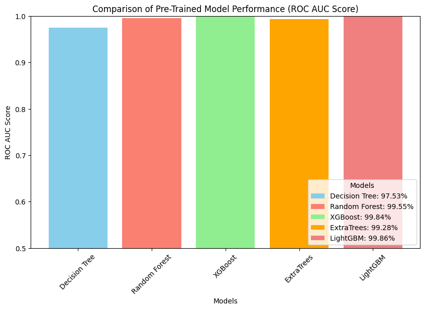

# 📰 Fake News Detection using Machine Learning

## 📌 Project Overview
This project focuses on **detecting fake news** using various Machine Learning models.  
The dataset was downloaded from **Kaggle** and contains labeled news articles (Fake / Real).  

We compare different models and evaluate them on **Accuracy** and **ROC AUC Score** to determine which performs best.

---

## ⚡ Dataset
- Source: [Kaggle Fake News Dataset](https://www.kaggle.com/datasets/aadyasingh55/fake-news-classification)  
- Features: News headlines, text content, labels (fake/real)  
- Target: `label` (True = 1, False = 0)

---

## 🧑‍💻 Models Trained
The following models were trained and evaluated:
- Decision Tree  
- Random Forest  
- XGBoost  
- ExtraTrees  
- LightGBM  

---

## 📊 Results

### 🔹 Accuracy
- **Decision Tree**: 97.54%  
- **Random Forest**: 98.24%  
- **XGBoost**: 98.50%  
- **ExtraTrees**: 97.04%  
- **LightGBM**: 98.45%  

### 🔹 ROC AUC Score
| Model          | ROC AUC Score |
|----------------|---------------|
| Decision Tree  | 97.53%        |
| Random Forest  | 99.55%        |
| XGBoost        | 99.84%        |
| ExtraTrees     | 99.28%        |
| LightGBM       | 99.86%        |

📌 LightGBM achieved the **best performance** with ROC AUC ≈ 0.9986.  

---

## 📷 Visualization
Here is a comparison of ROC AUC scores for all models:



---

🔬 Text Preprocessing & Feature Engineering --- How and Why
---------------------------------------------------------

### Goals

-   Normalize noisy raw news text into a compact, comparable representation.

-   Reduce vocabulary size and sparsity so linear/tree models learn robust patterns.

-   Avoid train--test leakage by learning text statistics **only on the training split**.

### Steps

1.  **Regex filtering → lowercase**

    -   `re.sub('[^a-zA-Z]', ' ', text)` keeps only letters and converts everything to spaces.

    -   **Why:** strips punctuation, digits, and URLs that often act as noise in this task; normalizes case for consistent token matching.

    -   **Trade‑off:** this *removes numbers and URLs*. If those might carry signal (e.g., "COVID‑19", links typical of fake sources), consider a more nuanced tokenizer instead of dropping them.

2.  **Stopword removal (NLTK)**

    -   Remove common words (e.g., *the, is, and*).

    -   **Why:** these function words dominate frequency but carry little discriminative power for fake/real labels, reducing dimensionality and noise.

    -   **Note:** remember to `nltk.download('stopwords')` in the environment once.

3.  **Stemming (Porter)**

    -   `PorterStemmer` reduces words to stems (e.g., *arguing → argu*).

    -   **Why:** collapses inflected forms to a shared root, shrinking vocabulary and improving generalization for bag‑of‑words features.

    -   **Alternative:** `SnowballStemmer('english')` is slightly more aggressive/consistent; **Lemmatization** (e.g., WordNet) preserves real words but needs POS info and is slower.

4.  **TF--IDF vectorization (`max_features=5000`)**

    -   Converts cleaned tokens to weighted features:

        -   **TF**: term frequency in a document

        -   **IDF**: down‑weights terms common across the corpus

    -   **Why:** emphasizes rare but informative words, which helps linear and tree‑based models.

    -   **Design choices:**

        -   `max_features=5000` caps dimensionality to stabilize training and reduce overfitting/memory.

        -   Fit the vectorizer **only on `X_train`** and transform `X_test` using the learned vocabulary to prevent leakage.

---

## 🚀 How to Run

### 1️⃣ Clone the Repository
```
git clone https://github.com/your-username/fake-news-detection.git
cd fake-news-detection
```

### 2️⃣ Install Dependencies
```
pip install -r requirements.txt
```

### 3️⃣ Run the Notebook
```
jupyter notebook FakeNewsDetection.ipynb
```


